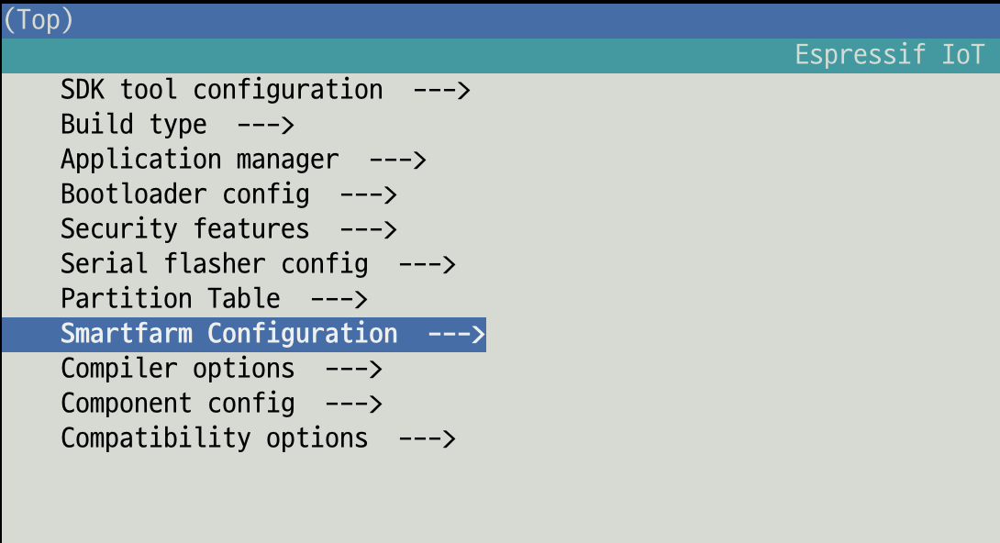
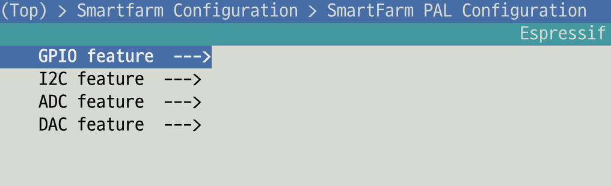
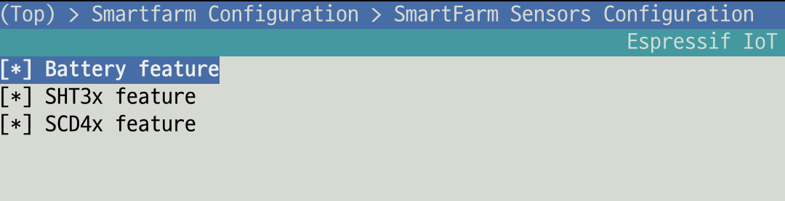

# SmartFarm IoT Framework

> **⚠ NOTE: This repository is an early stage for the development of the Smart Farm IoT framework and is an experimental repository that may change frequently.**

**Until the stabilization phase is reached, please proceed with the work in the repositories of each product.**

## Overview of SmartFarm IoT Framework

This framework is designed to act as a middleware between the hardware and the application layer so that application layer uses the same APIs regardless of the SDK of hardware manufacturer used in the product.

Currently, we are using espressif's esp32 hardware, but our goal is to create a framework that can operate on various hardware with minimal porting even if other hardware is used in the future.


<figure class="framework">
    <br>
</figure>


### Compoenents of Framework
+ Console command-line interface
  + Interactive command-line in console mode
  + Provides commands for debugging purposes
+ Configuration management
  + syscfg : Module that can set/get the system configuration of device in non-volatile storage area.
    + Configuration data of device
    + Manufacturing data of device
+ Event Messaging management
  + sysevent : Module that can trigger and receive an event between tasks.
    + Trgger/Receive an event and value between tasks
    + Register an event handler that is called when a specific event is received.
+ Network manaegemt
  + EasySetup : Zero touch setup without user intervention.
  + WiFi Management : Network recovery mechanism when wifi connections is not stable.
  + Supports other wireless technologies such as BLE, Zigbee, etc. (if needed)
+ Multi protocols
  + MQTT
  + HTTP/S
  + COAP
  + mDNS
  + UPnP/SSDP
  + ICMP Echo
  + TLS/OpenSSL
  + Modbus RTU (RS232, RS422, RS485) (if needed)
+ PAL(HAL) : Peripheral Abstraction Layer
  + ADC
  + DAC
  + I2C
  + SPI
  + UART
  + GPIO
  + PWM
  + LCD/LED (if needed)
+ Log management
  + Local log management (Console log message)
  + Remote log management (Send device log message to server)
+ OTA FW management
  + OTA FW update (Device <-> FW update server)
  + Auto recovery mechanism when fw update is failing.
+ Device management
  + Local command for device control
  + Supports timezone
  + Device grouping
+ Remote management
  + Register device information and capability to the Cloud server
  + Report status and value of device to the server
  + Command control through the server (Receiving a command from server and control it)
  + Device FW version management via server
+ Device(System) monitoring
  + Network connection checking
  + Device health checking
    + Task monitoring
+ Watchdog system
+ Security and Authentication management
  + Data protection and authentication data is used to communicate with Cloud server.
+ Sensor module
  + Temperature/Humidity
  + Co2
  + Weather Station
  + Water PH
  + Water EC
  + Soil Temperature/Humidity/EC


## Build System

**NOTE: This build system is in initial stage and may change significantly if future products use various hardware.**

Currently, the build system is configured to build our framework and product-specific firmware image using the esp-idf build system.

As shown in the figure below, if you run menuconfig and enter the component item, our own component menu is provided so that we can build the firmware image by selecting the components of our framework to suitable the characteristic of products.

SmartFarm IoT components to be used in our products will be continuously developed and added in the future.

```
(1) idf.py menuconfig

(2) Select Component config item in main menu

(3) SmartFarm Configuration is located at the middle of the config menu.

(4) Just select the feature items which are suitable for your product and build it.
    idf.py build
```

<figure class="menuconfig">
    <p>SmartFarm Configuration</p>
    <br>
    <p>PAL Configuration</p>
    <br>
    <p>Sensors Configuration</p>
    <br>
</figure>


### How to add new component of framework to build system

Two files need to be modified to add new component, these are `Kconfig.in` and `CMakeLists.txt`.

Note: Please **DO NOT** use the same name for the smartfarm component as espressif's idf component. If you want to use the same name, you should create a different directory to avoid duplicate and make it a subdirectory of that directory.

+ Make a directory that you need to add a component and then modify the `Kconfig.in` and `CMakeLists.txt`
+ If you want to add wifi library feature, here is the example for adding a new component

   (1) Make a sub-directory such as "wifi" in package directory

   (2) Implement the WiFi library codes here

   (3) Add configure item to the Kconfig.in
    ```bash
    config SMARTFRAM_WIFILIB_FEATURE
    bool "SmartFram WiFI library feature"
    default "y"
    help
      WiFi library that supports AP and STA mode
    ```
   (4) Add source and include to the CMakeLists.txt
    ```cmake
    set(req esp_wifi freertos log syslog sysevent)
    idf_component_register(SRCS "wifi_manager.c" "esp32/wifi_manager_impl.c"
                    INCLUDE_DIRS "."
                    REQUIRES ${req}
                    LDFRAGMENTS linker.lf)
    ```


The best avdantage of the strategy of making package components is that we can separate the component modules(codes) in each product directory.

And, we don't need to make the repository of each product, we can build the firmware image of each product in the framework repository. (i.e. we can make many products in single repository)

One more thing, CMakeLists.txt in the main product is simpler and easier to manage than in previous build systems.

- CMakeLists.txt in previous build system
<br>

- CMakeLists.txt in SmartFarm IoT build system
<br>

## Repository Directory Structure

The directory below shows only fully implemented modules, so many modules will be added to the repository in the near future.


```bash
├── docs : (SW design document, PRD, Tech specs, Datasheet)
│   └── ...
├── opensource : (Opensource packages)
│   └── ...
├── package : (SmartFarm IoT Framework components)
│   ├── mqttc : (MQTT client)
│   ├── pal : (Peripheral Abstraction Layer)
│   │   ├── adc
│   │   ├── dac
│   │   ├── gpio
│   │   └── i2c
│   │   └── ...
│   ├── sensor : (Sensor modules)
│   │   ├── battery
│   │   └── sht3x : (Temperature and Humidity sensor module)
│   │   └── ...
│   ├── setup : (EasySetup component)
│   │   └── certs
│   ├── shell : (Interactive command shell component)
│   │   ├── esp32
│   │   └── include
│   ├── syscfg : (Configuration component)
│   │   └── esp32
│   ├── sysevent : (Event messaging component)
│   │   └── esp32
│   ├── syslog : (Log component)
│   ├── time : (Timezone component)
│   └── wifi : (WiFi library component)
│       └── esp32
├── product
│   └── sensor_th : (Sensor for Temperature and Humidity)
│       ├── build : (Build directory)
│       └── main : (Application codes)
│   └── ... (Other sensor project)
└── thirdparty
    └── ...
```

### ESP-IDF

[ESP32-IDF] (https://github.com/espressif/esp-idf) (Framework)

[ESP32-IDF Programming Guide] (https://docs.espressif.com/projects/esp-idf/en/v4.4.1/esp32/index.html)

[ESP32-IDF Build System] (https://docs.espressif.com/projects/esp-idf/en/v4.4.1/esp32/api-guides/build-system.html?highlight=build%20system)


# SmartFarm IoT Framework

## SmartFarm IoT Framework 개요

> **⚠ 주의: 이 저장소는 스마트팜 IoT 프레임워크 개발을 위한 초기단계이고 변경이 빈번히 일어 날 수 있는 실험적인 저장소임을 공지해 드립니다**

스마트팜 IoT 프레임워크의 목적은 하드웨어와 어플리케이션 사이에 미들웨어로 동작하게끔 하여 칩 벤더에서 제공하는 SDK 의 종류와는 상관없이 어플리케이션에서는 동일한 APIs 을 사용하여 재사용성을 확보하도록 디자인 하는 것입니다.

향후에 새로운 하드웨어을 사용하더라도 최소한의 포팅 작업을 통하여 어플리케이션에서의 수정 작업이 일어 나지 않도록 하는 것이 목표입니다.


## IoT Framework 의 빌드 시스템

**주의: 현재 빌드 시스템은 초기 버전으로 앞으로 개발되어질 제품이 다양한 하드웨어를 사용할 경우 변경이 되어질 수 있습니다.**

새롭게 구성되어진 빌드 시스템은 esp-idf 의 빌드 시스템을 이용하여 스마트팜 IoT 프레임워크의 구성 요소들을 추가 하도록 지원하고 있고 다양한 제품별로 펌웨어 이미지를 빌드 할 수 있도록 설계 되었습니다.

기존 빌드 시스템과의 차이점은 제품 개발에 필요한 구성 모듈이 프로덕트 폴더에서 분리되어져서 다양한 제품군에서 이 구셩요소를 공용으로 사용 할 수 있다는 장점이 있습니다.

또한 프레임워크 저장소 안에서 여러 다양한 제품을 개발 할 수 있기 때문에 제품별 저장소를 만들어 관리할 필요가 없습니다.
(즉 단일 저장소을 사용하여 제품별 펌웨어를 만들수 있기에 관리가 쉽습니다)

Project (Product) 의 CMake 파일에서 package 컴포넌트 소스 코드들이 제거 되기 떄문에 CMake 파일 관리을 쉽게 할수 있습니다.

- 기존 빌드 시스템에서의 Project CMakeLists.txt
<br>

- SmartFarm IoT Framework 을 사용한 Project CMakeLists.txt
<br>


### 새로운 기능 모듈을 빌드 시스템에 추가 하는 방법

현재 빌드 시스템은 `Kconfig` 의 설정을 이용하여 기능모듈을 컴포넌트로 만들수 있습니다.
해당 모듈의 구성이 완료 되면 모듈의 소스를 `CMakeLists.txt` 에 추가를 하고 빌드를 하면 해당 기능을 사용할수 있습니다.

주의 : 스마트팜 에서 사용하는 컴포넌트는 esp-idf 에서 사용하는 컴포넌트의 이름과 같이 사용하면 설정에서 나타나지 않기 때문에 다른 이름을 사용하던가 같은 이름을 사용하고 싶으면 다른 이름의 디렉토리를 만들고 그 밑에 하위 디렉토리로 구성하면 됩니다.
mqtt component 의 경우를 참조 하세요.


Kconfig

```bash
   config SMARTFRAM_WIFILIB_FEATURE
   bool "SmartFram WiFI library feature"
   default "y"
   help
     WiFi library that supports AP and STA mode
```

CMakeLists.txt

```cmake
   set(req esp_wifi freertos log syslog sysevent)
   idf_component_register(SRCS "wifi_manager.c" "esp32/wifi_manager_impl.c"
                    INCLUDE_DIRS "."
                    REQUIRES ${req}
                    LDFRAGMENTS linker.lf)
```

## 저장소 디렉토리 구조

아래의 저장소 구조는 현재까지 개발 되어진 기능 모듈의 내용을 보여 주고 있으며, 개발이 진행 되고 있기에 모듈들이 계속 더 추가 될 예정입니다.

```bash
├── docs : (SW design document, PRD, Tech specs, Datasheet)
│   └── ...
├── opensource : (Opensource packages)
│   └── ...
├── package : (SmartFarm IoT Framework components)
│   ├── mqttc : (MQTT client)
│   ├── pal : (Peripheral Abstraction Layer)
│   │   ├── adc
│   │   ├── dac
│   │   ├── gpio
│   │   └── i2c
│   │   └── ...
│   ├── sensor : (Sensor modules)
│   │   ├── battery
│   │   └── sht3x : (Temperature and Humidity sensor module)
│   │   └── ...
│   ├── setup : (EasySetup component)
│   │   └── certs
│   ├── shell : (Interactive command shell component)
│   │   ├── esp32
│   │   └── include
│   ├── syscfg : (Configuration component)
│   │   └── esp32
│   ├── sysevent : (Event messaging component)
│   │   └── esp32
│   ├── syslog : (Log component)
│   ├── time : (Timezone component)
│   └── wifi : (WiFi library component)
│       └── esp32
├── product
│   └── sensor_th : (Sensor for Temperature and Humidity)
│       ├── build : (Build directory)
│       └── main : (Application codes)
│   └── ... (Other sensor project)
└── thirdparty
    └── ...
```
