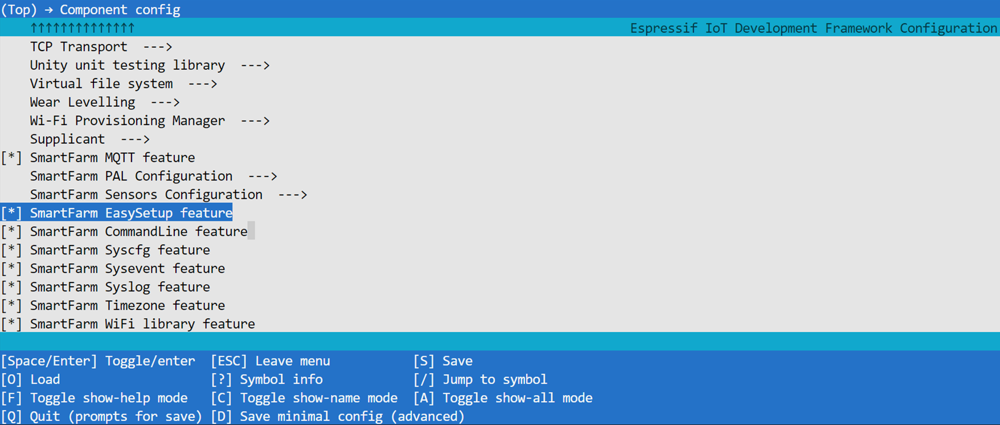
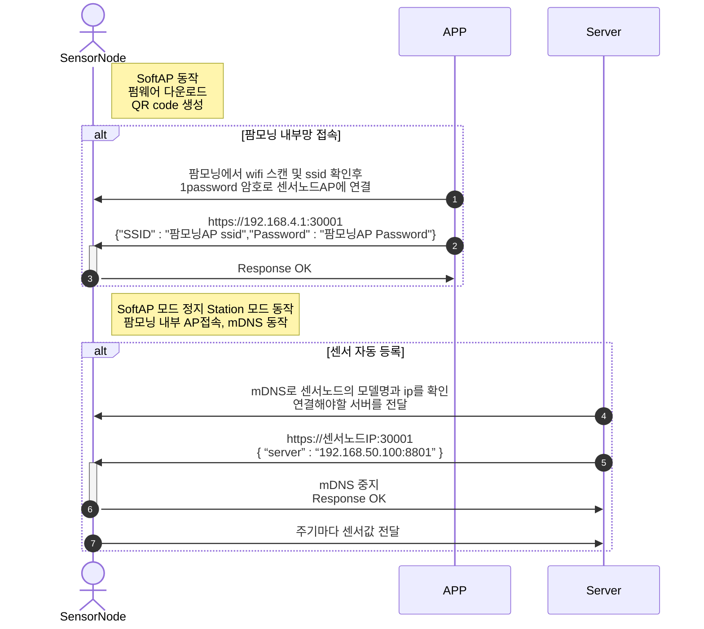

# Easy Setup

## 1. Wi-Fi 노드 설치 프로토콜

### 팜모닝 내부망 접속 (팜모닝PC → WiFi 센서노드)
  1. 노드가 SoftAP로 동작 (WiFi 센서 노드 -  ESP32 wifi chip board + Sensors)
  2. 팜모닝에서 wifi scan으로 노드를 검색하여 확인한다.
    1. 인식하면 SSID와 pre-defined된 AP로 접속한다.
  3. 커넥션이 되고 나면 노드의 포트(port : 30001)에 팜모닝 내부망 SSID와 PassWord를 전달.  
        (PC → Sensor node)
    1. 접속 IP address : (softAP 기본 게이트웨이 :Port) https://192.168.4.1:30001 
  4. 팜모닝의 AP정보 (SSID, PW) 전송 방식 : https(TLS v1.2) Post 방식
    1. SSID,PASSWORD 정보 전송
    2. {"SSID":"팜모닝AP ssid","Password":"팜모닝AP Password"}
    3. 타 회사 센서노드 사용 가능성으로 password 도 같이 전달
  5. 노드는 팜모닝 내부망 AP로 연결을 시도하고 성공하면 SoftAP mode 에서 Station mode 로 변경됨

### 센서 자동 등록 (센서노드 → 팜모닝 서버)
  1. 내부망에 연결된 노드는 mDNS로 자신의 MAC address 와 Key값을 Broadcasting
    1. Address : 모델명-MACaddress.local
    2. TXT : model : “모델명” 모델명 기준 및 모델명 List 참조
  2. 팜모닝에서 해당 노드에 연결 유무를 사용자 or 설치자 에게 확인(popup 형태)
  3. 확인을 누르면 mDNS로 받은 노드 ip의 Port (30001) 로 팜모닝에 접속 허용을 전달
    1. https(TLSv1.2)  Post방식으로 전달 :  https://IP:30001/
    2. JSON { “server” : “192.168.50.100:1883” }
  4. 팜모닝으로부터 접속 허용을 전달받은 노드는 포트(30001)와 mDNS를 닫습니다. 
  5. 정보를 전송
    1. 센서노드의 경우 시간마다 센서정보를 전송 (MQTT)
    2. 제어노드의 경우 제어시마다 제어정보를 전송

## 2. How to use Easy Setup

Easy Setup 을 진행하기 위해 esp-idf의 컴포너트 구성 중 "SmartFarm EasySetup feature" 포함 여부를 확인 바랍니다.(idf.py menuconfig)

## 3. Sequence Diagram

## 4. Easy Setup Library API

* create_easy_setup_task(void)
  
  Wi-Fi 노드 설치를 시작합니다. Free RTOS 의 Task 형태로 시작 됩니다. 연결 완료시  sysevent에 EASY_SETUP_DONE 을 "OK" 로 set 하고 Task를 종료합니다.

* is_router_connect(void)

  라우터와 연결이 되어있는지 확인 합니다. 연결이 되어있으면 1을 리턴 연결이 되어있지않으면 0을 리턴합니다.
