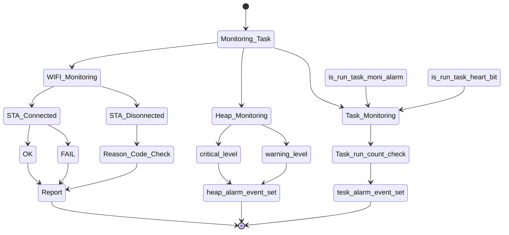

# Monitoring Task
##### WIFI 상태, heap_memory 상태, Task 상태 등 모니터링 하여 시스템 동작 이슈에 따른 대응 및 보고를 위한 시스템 구성요소 입니다.
##### 구성도는 다음과 같습니다.

- ### WIFI Monitoring loop
#### Wifi 모니터링은 STA Connected 와 STA Disconnected를 확인하여 WIFI 상태를 보여줍니다. 
   * #### STA Connected 일때 Report message.
            "Conneted SSID" 
   * #### STA Disonnected 일때 Report message.
            "UNSPECIFIED"
            "AUTH_EXPIRE"
            "AUTH_LEAVE"
            "ASSOC_EXPIRE"
            "ASSOC_TOOMANY"
            "NOT_AUTHED"
            "NOT_ASSOCED"
            "ASSOC_LEAVE"
            "ASSOC_NOT_AUTHED"
            "DISASSOC_PWRCAP_BAD"
            "DISASSOC_SUPCHAN_BAD"
            "UNSPECIFIED"
            "IE_INVALID"
            "MIC_FAILURE"
            "4WAY_HANDSHAKE_TIMEOUT"
            "GROUP_KEY_UPDATE_TIMEOUT"
            "IE_IN_4WAY_DIFFERS"
            "GROUP_CIPHER_INVALID"
            "PAIRWISE_CIPHER_INVALID"
            "AKMP_INVALID"
            "UNSUPP_RSN_IE_VERSION"
            "INVALID_RSN_IE_CAP"
            "802_1X_AUTH_FAILED"
            "CIPHER_SUITE_REJECTED"
            "BEACON_TIMEOUT"
            "NO_AP_FOUND"
            "AUTH_FAIL"
            "ASSOC_FAIL"
            "HANDSHAKE_TIMEOUT"
            "CONNECTION_FAIL"
- ### Heap Monitoring loop
#### 힙메모리 상태를 확인하여 Memory leck 발생시 sysevent를 발생 시킵니다.
   EVENT : 
   HEAP_CRITICAL_LEVEL_WARNING_EVENT(2048) HEAP_WARNING_LEVEL_WARNING_EVENT(1014)

- ### Task Monitoring loop
#### 생성된 Task의 상태를 확인 합니다. 새로만 들어진 Task는 is_run_task_moni_alarm()통해 Task를 Task_Monitoring에 등록하고, is_run_task_heart_bit()통해 Task loop alive 상태를 보고합니다. Task loop alive 가 발생되지 않을 시 sysevent를 발생 시킵니다.
   EVENT : TASK_MONITOR_EVENT
