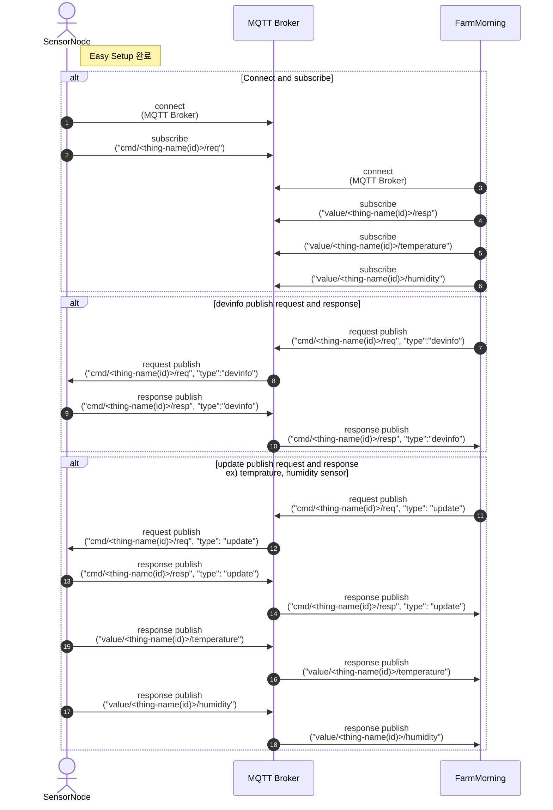
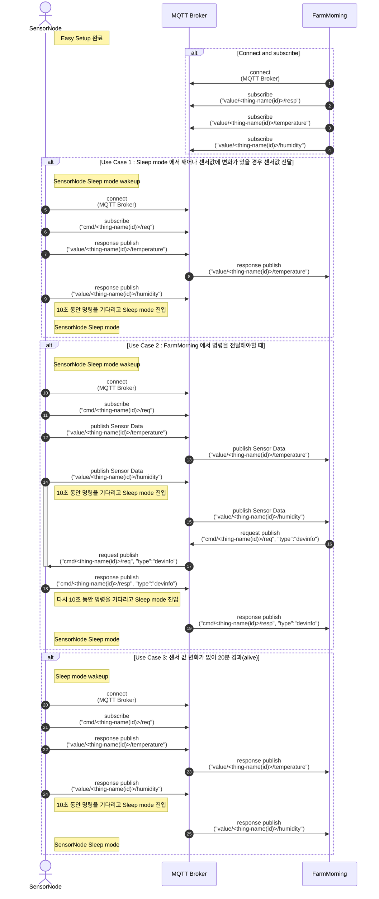
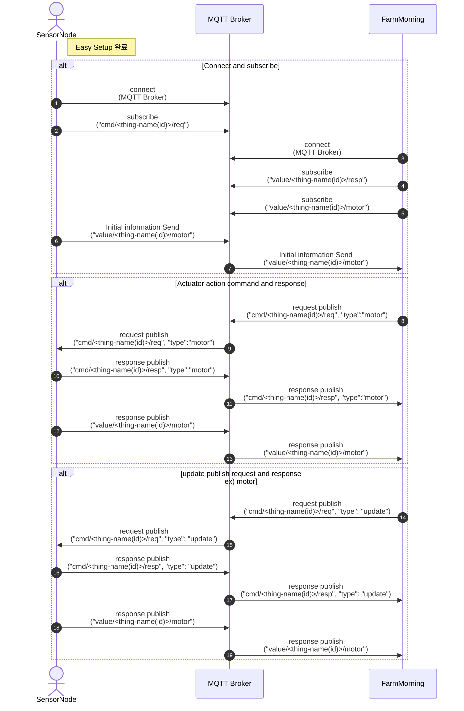

# MQTT

## 1. Overview

센서 및 구동기 노드의 메시지 송수신 프로토콜 입니다.

## 2. MQTT 토픽 Structure

### 센서 및 구동기 공용 Topic, Payload
```javascript
센서 노드 -> PC 명령어 구독
cmd/GLSTH-0EADBEEFFEE9/req
{
   type : devinfo, fwupdate, update, reset
}

센서노드 디바이스의 정보를 위한 명령어 토픽 및 페이로드
cmd/GLSTH-0EADBEEFFEE9/req
{
   "type":"devinfo"
}
cmd/GLSTH-0EADBEEFFEE9/resp
{
  "type":"devinfo",
  "id" : "GLSTH-0EADBEEFFEE9",
  "fw_version": "1.0.0",
  "farm_network" : {"ssid": "connected_farm_network-ssid", "channel": 1},
  "ip_address" : "192.168.50.100",
  "rssi" : -30,
  "send_interval" : 0,
  "power": "battery", or "plug" -- 파워 모드: 배터리(Battery), 상시전원(plug)
  "uptime" : "",
  "timestamp" : "2022-05-02 15:07:18"
}
id : 센서 노드의 unique_id
fw_version: 센서 노드의 펌웨어 버전.
farm_network : 센서 노드가 연결 되어진 팜모닝 AP SSID.
ip_address : 센서 노드의 ip address
rssi : 센서 노드의 wifi 수신 감도
send_interval : 센서 노드 정보의 송신 주기
power: batter파워 모드: 배터리(Battery), 상시전원(plug)
uptime : 센서 노드가 부팅 한 후 동작하는 시간
timestamp : 현재 시간

센서노드 디바이스의 펌웨어 업데이트를 위한 명령어 토픽 및 페이로드
cmd/GLSTH-0EADBEEFFEE9/req
{
  "type": "fw_update"
  "data": {"url" : "http://firmware_download_server_url"}
}
cmd/GLSTH-0EADBEEFFEE9/resp
{
   "type": "fw_update",
   "id" : "GLSTH-0EADBEEFFEE9",
   "state": "success",
   "fw_version": "1.0.1"
   "timestamp" : "2022-05-02 15:07:18"
}

센서노드 디바이스의 재시작을 위한 명령어 토픽 및 페이로드
cmd/GLSTH-0EADBEEFFEE9/req
{
  "type": "reset"
}
cmd/GLSTH-0EADBEEFFEE9/resp
{
   "type": "reset",
   "id" : "GLSTH-0EADBEEFFEE9",
   "state": "success"
   "timestamp" : "2022-05-02 15:07:18"
}

센서노드 변경된 정보 업데이트을 위한 명령어 토픽 및 페이로드
cmd/GLSTH-0EADBEEFFEE9/req
{
   "type": "update"
}
cmd/GLSTH-0EADBEEFFEE9/resp
{
   "type": "update"
   "id" : "GLSTH-0EADBEEFFEE9",
	 "state": "success"
   "timestamp" : "2022-05-02 15:07:18"
}

```
### Sensor Topic, Payload

```javascript
센서 노드 발행
예) 온습도 센서 노드의 상태 정보를 받는 토픽 
value/GLSTH-0EADBEEFFEE9/temperature

예) 온도 센서 노드의 payload data (json format)
value/GLSTH-0EADBEEFFEE9/temperature
{
   "id" : "GLSTH-0EADBEEFFEE9",
   "type": "air"
   "value" : 25.00,
   (default)"unit": "C" - (Optional),
   "battery" : 97.24 - (Optional)
   "timestamp" : "2022-05-02 15:07:18"
}

id : 센서 노드의 unique_id
type : 센서의 위치상태 (air : 공기, soil : 토양속, water : 수중)
value : 센서의 값
unit : default unit 의 경우 표시하지않고, 다른 unit 사용시 적용 - (Optional)
battery : 배터리 모델의 경우 배터리 용량 - (Optional)
timestamp : 현재 시간

예) 습도 센서 노드의 payload data (json format)
value/GLSTH-0EADBEEFFEE9/humidity
{
   "id" : "GLSTH-0EADBEEFFEE9",
   "type": "air"
   "value" : 25.00,
   "unit": "%" - (Optional),
   "battery" : 97.24 - (Optional),
   "timestamp" : "2022-05-02 15:07:18"
}

예) EC 센서 노드의 payload data (json format)
value/GLSSE-0EADBEEFFEE9/ec
{
   "id" : "GLSSE-0EADBEEFFEE9",
   "type": "soil"
   "value" : 1.000,
   "unit": "dS/m" - (Optional),
   "battery" : 97.24 - (Optional),
   "timestamp" : "2022-05-02 15:07:18"
}

예) ph 센서 노드의 payload data (json format)
value/GLSWP-0EADBEEFFEE9/ph
{
   "id" : "GLSWP-0EADBEEFFEE9",
   "type": "soil", "water",
   "value" : 4.5,
   "unit": "pH" - (Optional),
   "battery" : 97.24 - (Optional),
   "timestamp" : "2022-05-02 15:07:18"
}

예) Co2 센서 노드의 payload data (json format)
value/GLSCO-0EADBEEFFEE9/co2
{
   "id" : "GLSCO-0EADBEEFFEE9",
   "type": "air",
   "value" : 405,
   "unit": "ppm" - (Optional),
   "battery" : 97.24 - (Optional),
   "timestamp" : "2022-05-02 15:07:18"
}

예) 우적 센서 노드의 payload data (json format)
value/GLSRA-0EADBEEFFEE9/rain
{
   "id" : "GLSRA-0EADBEEFFEE9",
   "type": "air",
   "value" : 1,
   "unit": "int" - (Optional),
	 "battery" : 97.24 - (Optional),
   "timestamp" : "2022-05-02 15:07:18"
}

예) 일사 센서 노드의 payload data (json format)
value/GLSSO-0EADBEEFFEE9/solar
{
   "id" : "GLSSO-0EADBEEFFEE9",
   "type": "air",
   "value" : 400,
   "unit": "W/m2" - (Optional),
   "battery" : 97.24 - (Optional),
   "timestamp" : "2022-05-02 15:07:18"
}

예) 풍향 센서 노드의 payload data (json format)
value/GLSWS-0EADBEEFFEE9/windspeed
{
   "id" : "GLSWS-0EADBEEFFEE9",
   "type": "air",
   "value" : 360,
   "unit": "degree" - (Optional),
   "battery" : 97.24 - (Optional),
   "timestamp" : "2022-05-02 15:07:18"
}

예) 풍속 센서 노드의 payload data (json format)
value/GLSWD-0EADBEEFFEE9/winddirection
{
   "id" : "GLSWD-0EADBEEFFEE9",
   "type": "air",
   "value" : 400,
   "unit": "m/s" - (Optional),
   "battery" : 97.24 - (Optional),
   "timestamp" : "2022-05-02 15:07:18"
}

Fan-in 구독: value/+/humidity
단일 디바이스 구독: value/GLSTH-0EADBEEFFEE9/humidity


// 센서가 update 명령어를 수신 받은 경우 디바이스의 value topic 을 보냅니다.
// 위의 경우 처럼 온습도 센서 인 경우애는 다음과 같이 temperature/humidity topic을 발행합니다.
value/GLSTH-0EADBEEFFEE9/temperature
value/GLSTH-0EADBEEFFEE9/humidity


(1) 우적, 화재감지 같은 알람 센서같은경우 (비,화재 발생등의) event 변경시 send_interval 동안 
    센서정보 전송

(2) 온도나 습도같은 센서의경우 send_interval(sec) 을 통해 전송 주기마다 전송
 (2.1) 상시 전원 온습도 센서의 경우 - 매 주기(send_interval)마다 센서 데이터를 전송 
       (온습도의 변경 사항과 상관없이 읽은 데이터 전송)
 (2.2) 배터리 모델 - 매 주기(send_interval)마다 센서 데이터의 변동을 체크하여 
       설정한 delta 값 (온도의 경우 잠정적으로 0.5°C의 변화량 발생시, 테스트 필요) 
       이상의 차이가 있을 경우에만 전송
       참조 링크: 배터링 온습도 센서
       또한 센서노드로 명령을 전달 할 경우 센서노드가 sleep mode 에 있으므로 센서값을
       전달받고 10초 내로 전달하고싶은 명령을 전달하여야 응답 가능.
 (2.3) 센서노드의 alive 체크의 경우는 설정한 alive check time(예 20분) 마다 센서노드의 값 또는 
       devinfo 정보를 보내는 것으로 한다.

(3) 배터리형 모델의 경우 정보를 전송하고 난 후 sleep모드에 진입하여 토픽을 전달 받을 수 없음
    deep sleep 모드 진입시에 WiFi, MQTT 연결이 끊어짐 따라서 다시 wakeup 하기 전 까지는
    네트워크 통신이 가능하지 않음.

(4) 배터리 모델일 경우에는 센서 데이터 전송시 배터리 잔량을 보내는 것으로 그외 상시전원인 경우에는 
    보내지 않는 것으로, 서버에서는 devinfo 의 payload 의 power 의 battery 타입을 보고
    배터리 잔량을 체크 하면 됩니다.

(5) 현재 쓰고있는 기본 unit 가 1개이므로 default 일때는 unit 를 전송 하지않고,
    다른 unit 를 사용하게 될시, 전송 (되도록이면 f/w 에서 default unit로 변경하여 전송)
```

### Actuator Topic, Payload
```javascript
센서 노드 발행
예) 구동기 노드의 상태 정보를 받는 토픽 
value/GLASW-0EADBEEFFEE9/switch

예) 구동기(switch형) 노드의 상태 payload data (json format)
value/GLASW-0EADBEEFFEE9/switch
{
   "id" : "GLASW-0EADBEEFFEE9",
   "auto_mode" : "off",
   "value" : [{"io" : 1, "mode" : "on"},
              {"io" : 2, "mode" : "off"},
              {"io" : 3, "mode" : "on"},
              {"io" : 4, "mode" : "on"},
              {"io" : 5, "mode" : "on"},
              {"io" : 6, "mode" : "on"},
              {"io" : 7, "mode" : "on"},
              {"io" : 8, "mode" : "on"}],
   "timestamp" : "2022-05-02 15:07:18"
}

id : 노드의 unique_id
auto_mode : 자동 모드 켜짐(on), 꺼짐(off)
io : 포트번호(number)
value : 센서의 값
mode : 실제 동작 : 동작(on), 정지(off) 
timestamp : 현재 시간

예) 구동기(motor형) 노드의 상태  payload data (json format)
value/GLAMT-0EADBEEFFEE9/motor
{
   "id" : "GLAMT-0EADBEEFFEE9",
   "auto_mode" : "on",
   "value" : [{"io" : 1, "mode" : "open"},
              {"io" : 2, "mode" : "close"},
              {"io" : 3, "mode" : "close"},
              {"io" : 4, "mode" : "stop"}],
   "timestamp" : "2022-05-02 15:07:18"
}
sensor_id : 노드의 unique_id
auto_mode : 자동 모드 켜짐(on), 꺼짐(off)
io : 포트번호(number)
mode : 실제 동작 : 정회전(open), 역회전(close), 정지(stop) 
timestamp : 현재 시간

Fan-in 구독: value/+/motor
단일 디바이스 구독: value/GLAMT-0EADBEEFFEE9/motor

구동기 노드(switch 형) 변경된 정보 업데이트을 위한 명령어 토픽 및 페이로드
cmd/GLASW-0EADBEEFFEE9/req
{
   "type": "switch",
   "auto_mode" : "on",
   "value" : [{"io" : 1, "mode" : "on"},
              {"io" : 2, "mode" : "off"}]
}
cmd/GLASW-0EADBEEFFEE9/resp
{
   "type": "switch"
   "id" : "GLASW-0EADBEEFFEE9",
   "auto_mode" : "on",
   "value" : [{"io" : 1, "mode" : "on"},
              {"io" : 2, "mode" : "off"}],
	 "state": "success", //나중에 필요
   "timestamp" : "2022-05-02 15:07:18"
}

구동기 노드(motor형) 변경된 정보 업데이트을 위한 명령어 토픽 및 페이로드
cmd/GLAMT-0EADBEEFFEE9/req
{
   "type": "motor",
   "auto_mode" : "on",
   "value" : [{"io" : 2, "mode" : "open"}]
}
cmd/GLAMT-0EADBEEFFEE9/resp
{
   "type": "motor"
   "id" : "GLAMT-0EADBEEFFEE9",
   "auto_mode" : "on",
   "value" : [{"io" : 2, "mode" : "open"}],
	 "state": "success",
   "timestamp" : "2022-05-02 15:07:18"
}


※auto 모드 off 일경우 외부 스위치에 의해 동작하므로 value 값이 동작하지 않습니다.
구동기 (switch형, motor형) 노드의 경우 auto 모드가 off 일때는 value 값을 넣을 수 
없습니다. 
(value 값을 넣을시 value 값은 무시를하고 resp에서 표시하지 않습니다.)
cmd/GLAMT-0EADBEEFFEE9/req
{
   "type": "motor",
   "auto_mode" : "off"
   "value" : [{"io" : 2, "mode" : "open"}],
}
cmd/GLAMT-0EADBEEFFEE9/resp
{
   "type": "update"
   "id" : "GLAMT-0EADBEEFFEE9",
   "auto_mode" : "off",
	 "state": "success",
   "timestamp" : "2022-05-02 15:07:18"
}


// update 명령어를 수신 받은 경우 디바이스의 value topic 을 보냅니다.
// 위의 경우 처럼 구동기 모터 노드 인 경우애는 다음과 같이 motor topic을 발행합니다.
value/GLAMT-0EADBEEFFEE9/motor


(1) 구동기 노드 명령은 value 에 한개의 명령만 보낼수도, 여러개의 명령을 한번에 보낼수있음
(2) 명령에따른 value 응답은 처리가 가능한 명령을 value 응답으로 보냄
(3) 구동기 노드의 alive 체크의 경우는 설정한 alive check time(예 20분) 마다 구동기노드의
    value 정보를 보내는 것으로 한다.
```


## 3. MQTT Sequence Diagram

### Sensor(Plug Type)



### Sensor(Battery Type)



### Actutor
    


