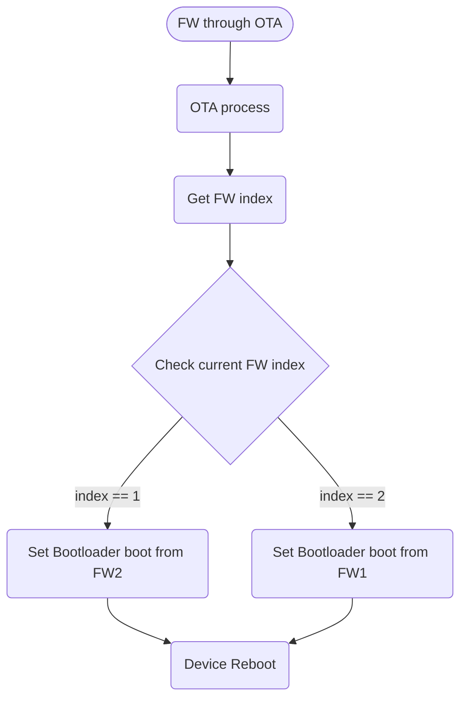

# SmartFarm IoT Framework: Over-the-Air Update (OTA)

## 1. Design Objectives

It should be support OTA feature to update the FW that fixes some issues or adds new feature via web server during the current FW image is running.


## 2. Design Consideration

* Support the HTTP/HTTPS transport layer for downloading FW image

* Support the function to ensure that only the correct FW image matching the device type can be updated.

* Support the signature or encrypted to verify the FW image that was generated by Greenlabs.
  * FW image with GPG signing(signature). or
  * Encrypted/Decrypted FW image using uniform key and this key will be located in eFuse area of all devices. or
  * ESP32 application image format can be used instead of GPG or Encryption/Decryption method.
  * ESP32 Application image format - [[https://docs.espressif.com/projects/esp-idf/en/latest/esp32/api-reference/system/app_image_format.html#]]
    * App(FW) Version
    * App(FW) Secure Version
    * App(FW) Project Name
    * Magic Word
    * Time & Date - Compile time and date
    * IDF version


## 3. SmartFarm OTA FW Update Process

The following items are used in typical OTA FW update process.

* FW download through OTA server
* OTA process
  * Check the validation of the downloaded FW image
  * Write FW image to the flash
* Get FW index
* Check current FW index
* SetBootPartitionFromFW 
  * The ESP32 BSP provides the esp_ota_set_boot_partition() such like SetBootPartitionFromFW
  * Set which FW image to boot from the bootloader.
* Device Reboot


### Typical Boot Process


### OTA Process



## 4. OTA FW APIs 

* OTA FW image state
```c
typedef enum ota_image_state {
  OTA_IMG_STATE_UNKNOWN = 0,   /*!< @breif The initial state of the OTA FW image */
  OTA_IMG_STATE_DOWNLOAD = 1,  /*!< @breif The state of the OTA FW image post successful download and reboot */
  OTA_IMG_STATE_ACCEPTED = 2,  /*!< @breif The state of the OTA FW image post successful download and successful self_test */
  OTA_IMG_STATE_REJECTED = 3,  /*!< @breif The state of the OTA FW image when the FW image has been verification failed */
  OTA_IMG_STATE_ABORTED = 4,   /*!< @breif The state of the OTA FW image when FW image downloading is failed */
} ota_image_state_t;

typedef enum fw_image_state {
  FW_IMG_STATE_UNKNOWN = 0,
  FW_IMG_STATE_DOWNLOADING = 1,
  FW_IMG_STATE_DOWNLOAD_SUCCESS = 2,
  FW_IMG_STATE_DOWNLOAD_FAILURE = 3,
  FW_IMG_STATE_VALID = 4,
  FW_IMG_STATE_INVALID = 5,
} fw_image_state_t;
```

* OTA FW Generic APIs
```c
1. ota_fw_abort();

2. ota_fw_download();

3. ota_fw_active_new_image();

4. ota_fw_reset_device();

5. ota_fw_get_state();

6. ota_fw_set_state();
```

* OTA FW PAL APIs
```c
1. fw_abort();

2. fw_download();

3. fw_active_new_image();

4. fw_reset_device();

5. fw_get_state();

6. fw_set_state();
```


## References

### Auto recovery mechanism
It must provide the auto recovery mechanism(Rollback to the previous FW image) when FW update is failed.

In App task, we increase the ErrorCount if FW update fails, when ErrorCount is bigger than 3 will trigger reboot process to boot from another FW image.

In case of ESP32, we will use ESP32's App rollback mechanism to implement auto FW recovery mechanism, because they provides APIs for this purpose. 

### Firmware update functionality

* FW Update API
  * Implement the API for the app to push FW update information to device.
  ```
  (1) UpdateFirmware
  (2) GetFirmwareVersion
  ```
* Checking free memory before downloading FW image
* Fetching module that it can download FW image from the Cloud(web) server
* Support signed FW image
* FW image vetification - How to check if the FW image is valid
  * Check if all tasks are running well after booting up, or
  * Check if diagnostic app works well with some operations.
* Flashing to FW image to persistence storage
* Temporary image management (Due to ram size limitation we may have to download image into flash and then process before saving)
  * In case of ESP32, ota_data partition will be used for this purpsoe.
* Provide FW status
* Report FW downloading status to the App or Cloud server
* Apply and Reboot (Changed boot partition)


### ESP32 OTA Overview

The OTA update mechanism allows a device to update itself based on data received while the normal firmware is running.

OTA requires configuration the [Partition Table](https://docs.espressif.com/projects/esp-idf/en/latest/esp32/api-guides/partition-tables.html) of the device with at least two "OTA app slot" partitions. (i.e. ota_0 and ota_1) and "OTA Data partition".

For factory boot settings, the OTA data partition should contain no data (all bytes erased to 0xFF).

In this case the esp-idf sw bootloader will boot the factory app if it is present in the partition table. If no factory app is included in the partition table, the first available OTA solt (usually `ota_0`) is booted.

After the first OTA update, the OTA data partition is updated to specify which OTA app slot partition should be booted next.


### ESP32 App rollback (Auto recovery mechanism)

This feature allows you to roll back to the previous working application is case a new application(FW) has critical errors.
When the rollback process is enabled and an OTA update provides a new version of the app, one of three things can happen:

* The application work fine , `esp_ota_mark_app_valid_cancel_rollback()` marks the running application with the state `ESP_OTA_IMG_VALID`.
There are no restrictions on booting this application.

* The application has critical errors and further work is not possible, a rollback to the previous application is required, `esp_ota_mark_app_invalid_rollback_and_reboot()` marks the running application with the state `ESP_OTA_IMG_INVALID` and reset.
This application will not be selected by the bootloader for boot and will boot the previous working application.

* If the `CONFIG_BOOTLOADER_APP_ROLLBACK_ENABLE` option is set, and a reset occurs without calling either function then the application is rolled back.

### App(FW) OTA State

States control the process of selecting a boot app:

|  States  |  Restriction of selecting a boot app in bootloader   |
|----------|------------------------------------------------------|
| ESP_OTA_IMG_VALID | None restriction. Will be selected.         |
| ESP_OTA_IMG_UNDEFINED | None restriction. Will be selected.     |
| ESP_OTA_IMG_INVALID | Will not selected.                        |
| ESP_OTA_IMG_ABORTED | Will not selected.                        |
| ESP_OTA_IMG_NEW     | If CONFIG_BOOTLOADER_APP_ROLLBACK_ENABLE option is set it wll be selected only once. In bootloader the state immediately changes to `ESP_OTA_IMG_PENDING_VERIFY`.|
| ESP_OTA_IMG_PENDING_VERIFY | If CONFIG_BOOTLOADER_APP_ROLLBACK_ENABLE option is set it will not be selected, and the state will change to `ESP_OTA_IMG_ABORTED`. |

If `CONFIG_BOOTLOADER_APP_ROLLBACK_ENABLE` option is not enabled (by default), then the use of the following functions `esp_ota_mark_app_valid_cancel_rollback()` and `esp_ota_mark_app_invalid_rollback_and_reboot()` are optional, and `ESP_OTA_IMG_NEW` and `ESP_OTA_IMG_PENDING_VERIFY` states are not used.


### App(FW) Rollback Process

* After downloading the FW image, and `esp_ota_set_boot_partition()` function marks this paratition bootable and sets the state `ESP_OTA_IMG_NEW`

* Reboot `esp_restart()`

* The bootloader checks for the `ESP_OTA_IMG_PENDING_VERIFY` state if it is set, then it will be written to `ESP_OTA_IMG_ABORTED`.

* The bootloader checks for the selected application(FW) for `ESP_OTA_IMG_NEW` state if it is set, then it will be written to `ESP_OTA_IMG_PENDING_VERIFY`. This state menas that the application requires confirmation of its operability, if it does not happen and a reboot occurs, this state will be written to `ESP_OTA_IMG_ABORTED` and this application will no longer be able to start, i.e. there will be a rollback to the previous working application(FW).

* A new applocation(FW) has started and should make a self-test

* If the self-test has completed successfully, then you must call the function `esp_ota_mark_app_valid_cancel_rollback()` because the application is awaiting confirmation of operability.

* If the self-test fails then call `esp_ota_mark_app_invalid_rollback_and_reboot()` function to roll back to the previous working application, while the invalid application is set `ESP_OTA_IMG_INVALID` state.

* If the application has not been confirmed, the state remains `ESP_OTA_IMG_PENDING_VERIFY`, and the next boot it will be changed to `ESP_OTA_IMG_ABORTED`. That will prevent re-boot of this application. There will be a rollback to the previous working application.


