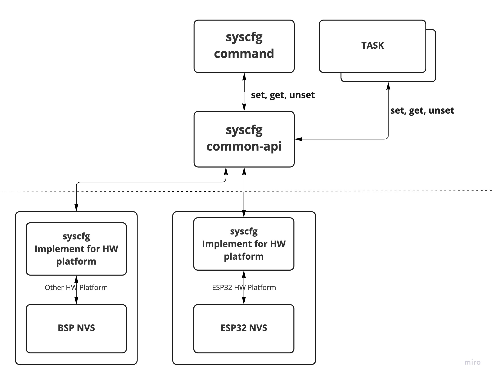

## 1. Design Objectives
System Configuration (syscfg for short) is a component that provides home grown solution for (1) access and (2) persistent storage of system configuration variables and manufacturing data. This is an evolution of NVRAM component typically found in embedded systems to store system configuration.

Syscfg needs to support persistent storage to multiple media like Flash and other devices and provide better namespace capability than a simple name=value(key-value) scheme (KVS).

## 2. Design Considerations
1. Avoid OS(RTOS, Kernel) based solution for easy portability.
2. Support multiple storage targets, particularly file based.
3. Support namespace

## 3. Advantages over current BSP NVRAM solution
BSP NVRAM is a specific hardware vendor's solution for storing system configuration. 
And it is tightly coupled with the vendor's software stack.

Syscfg is a complete generic APIs solution. Application layer does not need any change when HW chip is changed and it is easily portable to any platform where nvram is applicable.

 

## 4 Configuration and Manufacturing Data
Syscfg can access the system configuration and manufacturing data using syscfg_type_t (type) parameter (CFG_DATA, MFG_DATA).

* CFG_DATA area used to read/write the system configuration data that will be changed while running the FW image.
* MFG_DATA area used to read/write the manufacturing data that was populated in the manufacturing process.

  Most of the manufacturing data is only readable, except for certification data that is updated if necessary.

* CFG_DATA size : 144KB
* MFG_DATA size : 24KB

## 5. Syscfg Library API

* syscfg_init(void)
  
  Intialize the system configuration module. Returns 0 on success, -1 on error. This is the first API a client process need to call.
  Without this all set/get api will return with failure.

* syscfg_open(void)

  Open the NVS partition to read/write the data from/to the NVS. Returns 0 on success, -1 on error.

* syscfg_close(void)
  
  Close the NVS partition when no longer need to use it.

* syscfg_set(syscfg_type_t type, const char *key, const char *value)

  Add an entry(configuration data) into syscfg. Returns 0 on success, -1 on error. Note, persistent store contents not changed until 'commit' operation.

  + type - Configuration data, or Manufacturer data
  + key - key name string, entry to add
  + value - value string to associate with key name

* syscfg_get(syscfg_type_t type, const char *key, char *value, size_t value_len)

  Retrieve an entry from syscfg. Returns 0 on success, -1 on error

  + type - Configuration data, or Manufacturer data
  + key - key name string, entry to add
  + value - buffer to store output value stting
  + value_len - output value buffer size

* syscfg_unset(sysfg_type_t type, const char *key)

  Remove an entry from syscfg. Returns 0 on success, -1 on error

  + type - Configuration data, or Manufacturer data
  + key - key name to unset(remove) value from syscfg
 
