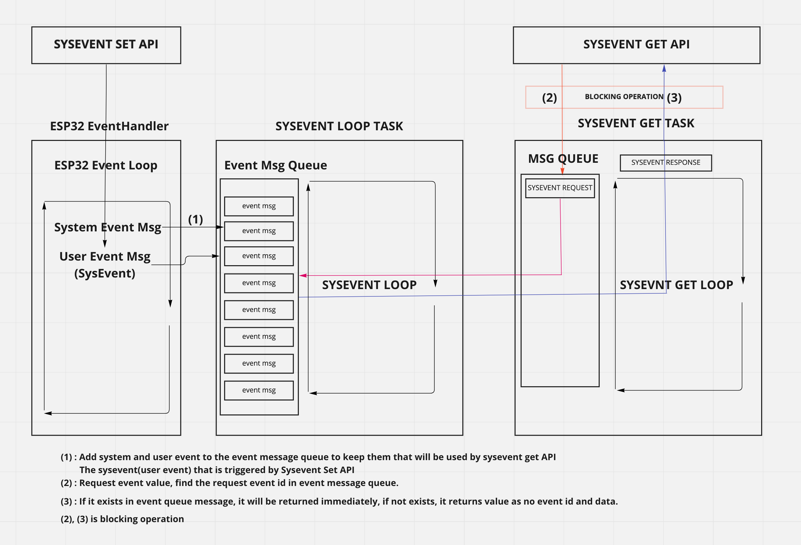

## 1. Design Objectives
It aims to develop an event messaging system that applications can use in common to solve the problem of triggering or receiving events with different event messaging methods on the different hardware platforms.

This document elaborates on the implementation of the event passing functionality.

## 2. Framework Overview

The sysevent module provides the following components:
1. A library that abstracts registration for events and transport of events between event generators and event handlers
2. An event task that maintains metadata about registrants, events, and methods for signaling events per registrant.

A library has two API that are able to set/get an event between event source and sink.
+ sysevent_set
+ sysevent_get

An event task consists of two components : 
+ The sysevent loop task keeps the event message which comes from the system and user until receiving an event from the event sink.
+ The sysevent get task requests the type of event that wants to receive from the event sink and operates in blocking mode until the requested event value is received. 
If there is no requested event in event message queue in sysevent loop task, it will returns value as no event data and id.

### Sysevent flow 

 
